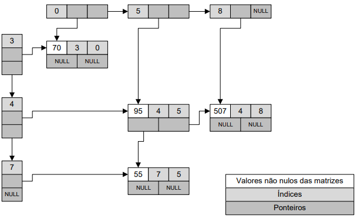

## Desafio 1 - Matrizes esparsas

Uma matriz esparsa é uma matriz que possui poucos elementos diferentes de zero.
Por exemplo:

    0 0 0 0 0 0
    0 0 0 5 3 0
    0 0 0 4 0 0
    0 0 0 0 0 0

Armazenar uma matriz com um vetor multidimensional simples (`int matriz[4][6]`)
implica em alocar muita memória para armazenar zeros. Uma maneira mais eficiente
de armazenar esse tipo de matriz é guardar apenas os elementos que são diferentes
de zero.

É possível implementar esse tipo de matriz utilizando uma estrutura enlaçada, 
como indicado a seguir:

  

A estrutura enlaçada anterior corresponde à seguinte matriz:

      0   0   0   0   0   0   0   0   0
      0   0   0   0   0   0   0   0   0
      0   0   0   0   0   0   0   0   0
     70   0   0   0   0   0   0   0   0
      0   0   0   0   0  95   0   0 507
      0   0   0   0   0   0   0   0   0
      0   0   0   0   0   0   0   0   0
      0   0   0   0   0  55   0   0   0

## Exercício

Escreva um programa que receba duas matrizes esparsas A e B e retorne o
resultado de A x B. Coloque o código no arquivo `matriz.c`.

## Código

Escrever o programa em linguagem C, salve o código no arquivo `matriz.c`.

O programa deverá utilizar uma **estrutura enlaçada** (como indicada na
figura anterior) para armazenar as matrizes A e B.

A **multiplicação** deve ser realizada sobre a **estrutura enlaçada**, ou
seja, não é para criar uma estrutura multidimensional auxiliar 
(`int matriz[x][y]`). **Não utilize arranjos/arrays no código**. Utilizar
uma estrutura auxiliar desse tipo pode tornar o uso da estrutura enlaçada
muito ineficiente.

## Entrada

O sistema receberá inicialmente seis inteiros: `LA`, `CA`, `NA`, `LB`,
`CB`, `NB`. Cada um representa:

- `LA`: número de linhas na matriz A;
- `CA`: número de colunas na matriz A;
- `NA`: quantidade de números diferentes de zero na matriz A;
- `LB`: número de linhas na matriz B;
- `CB`: número de colunas na matriz B;
- `NB`: quantidade de números diferentes de zero na matriz B;

Após isso, o sistema receberá `NA + NB` entradas no formato: 
`[linha] [coluna] [número]`.

Os `NA` primeiros números são para a matriz A e os `NB` seguintes para 
a matriz B. Todos os números são inteiros (`int`).

Os índices `[linha]` e `[coluna]` iniciam em zero. Entre as entradas
de cada matriz, elas não são necessariamente passadas em ordem. Por
exemplo, podem ser passadas algumas entradas para a linha 0 da matriz A,
algumas para a linha 1 e depois outras para a linha 0 novamente:

    0 0 1
    0 5 1
    1 0 1
    1 0 1
    1 8 1
    0 3 1
    0 2 1

Depois da leitura das matrizes, o programa receberá uma sequência de comandos
em forma de `char`. Para cada comando, o comportamento será o seguinte:

- `A`: imprime a matriz A;
- `B`: imprime a matriz B;
- `M`: imprime a matriz do resultado da multiplicação A x B. Imprime `ERRO` se
a multiplicação não é possível;
- `S`: sair (encerra o programa).

## Saída

Imprimir as matrizes A, B ou a matriz resultado da multiplicação A x B, conforme
o comando recebido. Veja nos exemplos como é o formato de impressão das matrizes.

## Exemplo 1

<table>
  <thead>
    <th>Entrada</th>
    <th>Saída</th>
  </thead>
  <tbody>
    <tr>
      <td><pre>2 5 5 5 2 5
0 0 1
0 1 1
0 2 5
1 4 1
1 3 1
0 0 1
1 0 1
2 1 2
3 0 1
4 0 4
A
B
M
S
</pre></td>
      <td valign="top"><pre>[1 1 5 0 0 ]
[0 0 0 1 1 ]

[1 0 ]
[1 0 ]
[0 2 ]
[1 0 ]
[4 0 ]

[2 10 ]
[5 0 ]
</pre></td>
    </tr>
  </tbody>
</table>

## Exemplo 2

<table>
  <thead>
    <th>Entrada</th>
    <th>Saída</th>
  </thead>
  <tbody>
    <tr>
      <td valign="top"><pre>7 10 4 10 3 4
0 2 5
0 6 8
3 2 8
3 9 4
0 1 1
2 1 7
9 2 2
6 2 2
A
B
M
S
</pre></td>
      <td valign="top"><pre>[0 0 5 0 0 0 8 0 0 0 ]
[0 0 0 0 0 0 0 0 0 0 ]
[0 0 0 0 0 0 0 0 0 0 ]
[0 0 8 0 0 0 0 0 0 4 ]
[0 0 0 0 0 0 0 0 0 0 ]
[0 0 0 0 0 0 0 0 0 0 ]
[0 0 0 0 0 0 0 0 0 0 ]

[0 1 0 ]
[0 0 0 ]
[0 7 0 ]
[0 0 0 ]
[0 0 0 ]
[0 0 0 ]
[0 0 2 ]
[0 0 0 ]
[0 0 0 ]
[0 0 2 ]

[0 35 16 ]
[0 0 0 ]
[0 0 0 ]
[0 56 8 ]
[0 0 0 ]
[0 0 0 ]
[0 0 0 ]
</pre></td>
    </tr>
  </tbody>
</table>