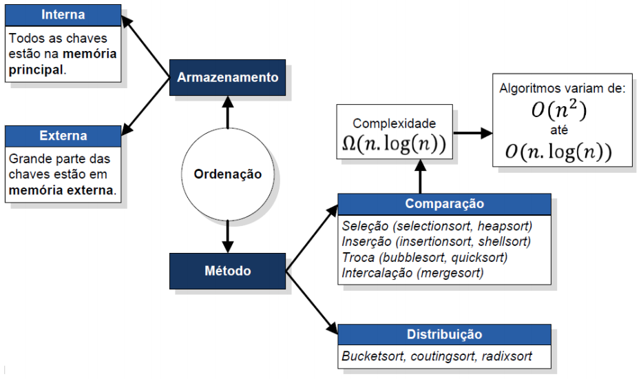
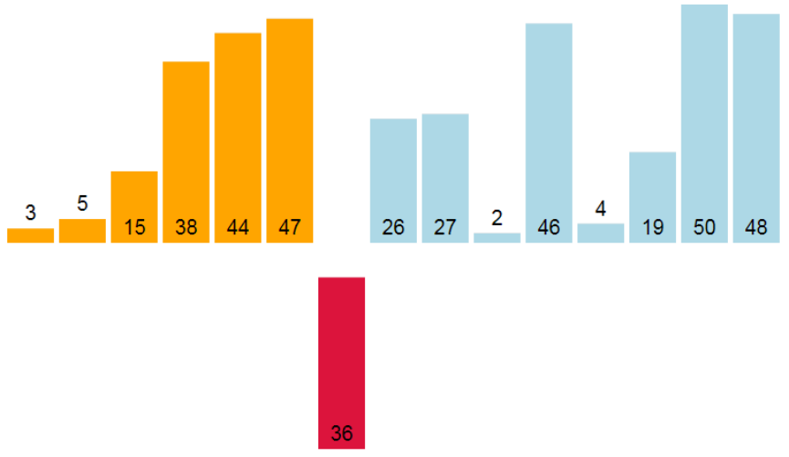

# Algoritmos de Ordenação Simples

## Introdução

### O problema da Ordenação (Sorting)

O problema de ordenar uma sequência de  elementos de dados
 consiste em obter uma permutação dos elementos
tal que  onde  é uma
**ordem** total definida para uma parte do registro de dado (*chave*).

<p align="center">
  
</p>

### O problema de embaralhar (Shuffling)

Operação contrária a ordenar que consiste em obter uma permutação
aleatória de uma sequência de dados.

```c
void shufflingArr (int * v, int n) {
  for (int i = n - 1; i > 0; i--) {
    int r = rand() % (i + 1);  // Random int between 0...i
    int aux = v[i];            // Swap
    v[i] = v[r];
    v[r] = aux;
  }
}
```

### Vantagens de ordenar

- Melhora a visualização dos dados;
- Após ordenar a busca (elemento, mínimo, máximo) é mais eficiente;
- Permite remover elementos repetidos, checar se não há repetições,
calcular a distribuição de frequências com facilidade;
- Passo inicial para resolver de forma mais simples/eficiente um problema
ex. calcular a mediana e a moda, obter uma árvore geradora mínima,
construir uma árvore B+;
- Usada em muitas áreas da Computação, ex. banco de dados, sistemas
operacionais, recuperação de informação etc.

### Tipos de Ordenação

<p align="center">
  
</p>

### Características dos Algoritmos de Ordenação

- **In-place:** se a quantidade de memória auxiliar utilizada
pelo algoritmo é .

  Exemplo: Mergesort não é um algoritmo in-place.
- **Estável:** se a ordem relativa dos itens com chaves iguais
mantém-se inalterada.

  Exemplo: Quicksort não é um algoritmo estável.
- **Adaptativo:** se o fato da sequência já estar ordenada
afeta a complexidade do algoritmo.

  Exemplo: Insertionsort.
- **Híbrido:** se usa vários métodos.

  Exemplo: Timsort.
- **Paralelo:** se usa múltiplos processadores para ordenar.

  Exemplo: Spaghetti sort, Bitonic mergesort.
- **Ordenação Parcial:** se ordena somente os  primeiros elementos.

  Exemplo: Quickselect.

## Algoritmos de ordenação simples: Insertion Sort e Selection Sort

### Ordenação por seleção - Selection Sort

    repeat (numOfElements - 1) times
      set the first unsorted element as the minimum
      for each of the unsorted elements
        if element < currentMinimum
          set element as new minimum
      swap minimum with first unsorted position

**Funcionamento:** 

- selecione o mínimo da parte não ordenada;
- coloque o mínimo na posição .

### Ordenação por inserção - Insertion Sort

<p align="center">
  
</p>

    mark first element as sorted
    for each unsorted element X
      'extract' the element X
      for j = lastSortedIndex down to 0
        if current element j > X
          move sorted element to the right by 1
        break loop and insert X here

**Funcionamento:** 

- insira o elemento  na posição correta da parte ordenada.

### Implementação

#### Selection sort

```c
int selectionSort (int * v, int n) {
  int i, j, min, aux;
  long int comp = 0;

  for (i = 0; i < n - 1; i++) {
    min = i;
    for (j = i + 1; j < n; j++) {
      if (v[min] > v[j])
        min = j;
      comp++;
    }

    if (min != i) {
      aux = v[min];
      v[min] = v[i];
      v[i] = aux;
    }
  }

  return comp;
}
```

#### Insertion sort

```c
int insertionSort (int * v, int n) {
  int i, j, key;
  long int comp = 0;

  for (i = 1; i < n; i++) {
    key = v[i];
    j = i - 1;
    while (j >= 0 && ++comp && v[j] > key) {
      v[j + 1] = v[j];
      j--;
    }
    v[j + 1] = key;
  }

  return comp;
}
```

Ver código completo [aqui](basic-sorting.c).

### Análise Selection Sort

|                                  | Comparações          | Movimentações |
| -------------------------------- | -------------------- | ------------- |
| Caso melhor (sequência em ordem) |  |            |
| Caso pior                        |  |     |

- Melhor algoritmo para sequências pequenas com registros muito grandes;
- In-place, não adaptativo, não estável.

**Qual o caso pior do selection sort? Por que não é estável?**

### Análise Insertion Sort

|                                        | Comparações          | Movimentações |
| -------------------------------------- | -------------------- | ----------------------- |
| Caso melhor (sequência em ordem)       |               |                          |
| Caso pior (sequência em ordem reversa) |  |  |

- Algoritmo apropriado para sequências pequenas ou quando se deseja
adicionar poucos registros a uma sequência ordenada;
- In-place, adaptativo e estável.

## Referências Bibliográficas

- Algorithms, Robert Sedgewick and Kevin Wayne, 4th Edition, 2011.

  Slides: http://algs4.cs.princeton.edu/lectures/
- Introduction to Algorithms, 3rd Edition. Thomas H. Cormen, Charles E. 
Leiserson, Ronald L. Rivest and Clifford Stein, 2009.
- The Art of Computer Programming 3rd Edition, Donald Knuth, 1997.
- Projeto de Algoritmos, 2ª Edição, Nivio Ziviani, 2007.
- Estruturas de Dados e seus Algoritmos, 3ra edição, Jayme L.
Szwarcfiter and Lilian Markezon, 2010.
- Wikipedia: https://en.wikipedia.org/wiki/Sorting_algorithm