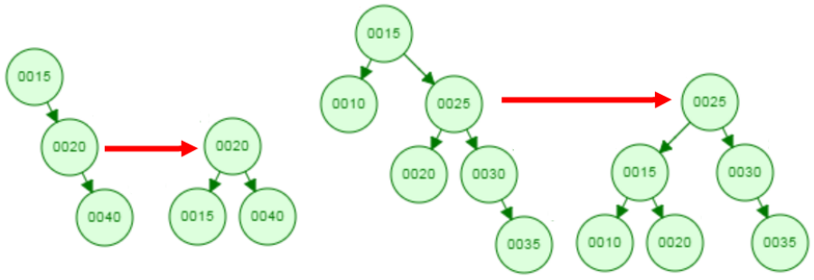
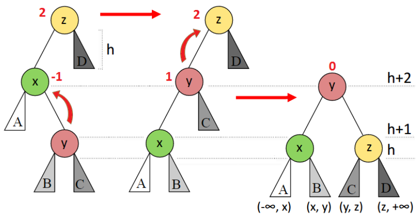
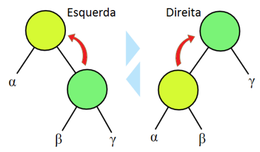

# Árvores AVL

## Introdução

### Aulas anteriores - Estratégias de Busca - Caso Pior

| Técnica          | Ordem | Busca     | Inserção  | Remoção   |
| ---------------- | :---: | :-------: | :-------: | :-------: |
| Busca sequencial | Não   | $n$       | $n$       | $n$       |
| Busca Binária    | Sim   | $\log(n)$ | $n$       | $n$       |
| ABB              | Sim   | $h$       | $h$       | $h$       |
| ???              | Sim   | $\log(n)$ | $\log(n)$ | $\log(n)$ |

<p align="center">
  
</p>

- As operações nas ABBs tem custo entre $O(\log(n))$ e $O(n)$;
- O caso melhor acontece quando elas são completas;
- Por que não "completar" a árvore após inserir/remover?

  Custo elevado $O(n)$.
- Na verdade as ABBs não precisam ser completas para ter custo $O(\log(n))$;
basta serem **balanceadas**;
- Que tipo de **balanceamento**?
- Como balancear de forma eficiente e ao mesmo tempo preservar a ordem
simétrica após inserir/remover?

### Árvores Balanceadas

- Balanceamento pela altura (*height balance*): AVL trees, red-black trees.

  https://en.wikipedia.org/wiki/Red-black_tree

<p align="center">
  
</p>

- Balanceamento perfeito pela altura (*perfect height balance*):
2-3 trees, 2-3-4 trees, B trees (B+, B*).

  https://en.wikipedia.org/wiki/B+tree

<p align="center">
  
</p>

- Balanceamento pela "classe" (*rank balance*): WAVL trees **[1]**.

- Balanceamento pela frequência de acesso: splay trees **[2]**.

- Balanceamento pelo número de nós: weight-balanced binary trees **[3]**.  

**[1]**: Rank-balanced trees: Haeupler B., Sen, S., Tarjan, R. E., ACM Transactions 
on Algorithms, 2015

**[2]**: Self-Adjusting Binary Search Trees: Sleator, Daniel D., Tarjan, Robert E.
Journal of the ACM, 1985

**[3]**: Binary Search Trees of Bounded Balance: Nievergelt, J., Reingold, E. M.
SIAM Journal on Computing, 1973

## Árvores AVL

### Árvores Binárias Balanceadas pela Altura

**Altura de um nó:** número de passos do mais longo caminho até uma folha.

\begin{equation*}
  \begin{cases}
    -1 & \text{ se } n = \texttt{NULL} \\
    \mathrm{max}\left((n \rightarrow \mathrm{esq}), h(n \rightarrow \mathrm{dir})\right) + 1 & \text{ se } n \neq \texttt{NULL}
  \end{cases}
\end{equation*}

<p align="center">
  
</p>

### Árvores Binárias AVL

Primeiras árvores balanceadas, propostas em 1962 pelos cientistas russos
Georgy **A**delson-**V**elsky e Evgenii **L**andis **[4]**.

- para cada nó na árvore, a diferença de altura de suas duas sub-árvores é
no máximo 1.

<p align="center">
  
</p>

**[4]**: An algorithm for the organization of information. Proc. USSR Academy of
Sciences, 146: 263-266, 1962

### Árvore AVL e Fator de Balanceamento de um nó $n$

$$FB(n) = h(n \rightarrow \mathrm{esq}) - h (n \rightarrow \mathrm{dir})$$

<p align="center">
  
</p>

- Uma ABB é **AVL** se para cada nó $n$, $| FB(n) | \leq 1$.

<p align="center">
  
</p>

<p align="center">
  
</p>

**Exercício:** Quais das ABBs abaixo são AVL?

<p align="center">
  
</p>

### Exemplo de Implementação - Árvore AVL

Pode ser implementada armazenando a altura ou o fator de balanceamento.

```c
typedef struct AVLTreeNode AVLTreeNode;
struct AVLTreeNode {
  int key;
  int height; // unsigned short balanceFactor;

  // Pointers to the left and right children of the node.
  AVLTreeNode * left, * right;
}

void updateHeight (AVLTreeNode * n) {
  if (!n) return;
  int hl = (n->left)  ? n->left->height  : -1,
      hr = (n->right) ? n->right->height : -1;
  n->height = (hl > hr ? hl : hr) + 1;
}

const int LEFT_HEAVY = -1, BALANCED = 0, RIGHT_HEAVY = 1;

int balanceFactor (AVLTreeNode * n) {
  if (!n) return 0;
  updateHeight(n);
  return n->left->height - n->right->height;
}
```

## Análise das Árvores AVL

Qual é a altura máxima $h$ que pode ter uma árvore AVL de $n$ nós?

**Prova:** Usar pergunta equivalente: fixando $h$, qual é a menor árvore
AVL (Nº de nós) que pode ser construída com altura $h$? Seja $N(h)$ o
menor número de nós de uma árvore AVL de altura $h$.

- $N(0) = 1$ e $N(1) = 2$
- Se $h > 1$ as sub-árvores esquerda e direita terão no máximo altura
$h - 1$. Na verdade, para fazer com que a árvore tenha o menor número
de nós possível (sem violar a condição de AVL) então uma sub-árvore terá
altura $h - 1$ e a outra $h - 2$. Isto leva à recorrência

$$N(h) = N(h - 1) + N(h - 2) + 1 \ \ \ \ \ \text{ se } h > 1$$

### Menor árvore AVL de altura $h$

\begin{gather*}
  N(0) = 1;\ N(1) = 2 \\
  N(h) = N(h - 1) + N(h - 2) + 1 \ \ \ \ \ \text{ se } h > 1
\end{gather*}

<p align="center">
  
</p>

Para $h - 1$ temos $N(h - 1) = N(h - 2) + N(h - 3) + 1$, logo

\begin{align*}
  N(h) &= (N(h - 2) + N(h - 3) + 1) + N(h - 2) + 1 \\
  & \Rightarrow N(h) > 2 \cdot N(h - 2)  \\
  & \Rightarrow N(h) > 2 \cdot N(h - 2) > 2 \cdot 2 \cdot N(h - 4) > \dots > 2^{\frac{h}{2}}
\end{align*}

\begin{gather*}
  N(h) > 2^{\frac{h}{2}} \Rightarrow \log_2(N(h)) > \log_2(2^{\frac{h}{2}}) \\
  h < 2 \cdot \log_2(N(h))\ \ \ \square
\end{gather*}

Desta forma, para quaquer outra árvore com $n$ nós e altura $h$

$$n \geq N(h) > 2^{\frac{h}{2}} \Rightarrow \log_2(n) > \log_2(2^{\frac{h}{2}}) \Rightarrow h < 2 \cdot \log_2(n)$$

Qual é a altura máxima $h$ que pode ter uma árvore AVL de $n$ nós?

**Resposta:** A altura de uma árvore AVL com $n$ nós é $O(\log_2(n))$.

Resolvendo melhor a recorrência (notar que é parecida com a recorrência
dos números de Fibonacci)

\begin{gather*}
  N(0) = 1;\ N(1) = 2 \\
  N(h) = N(h - 1) + N(h - 2) + 1 \ \ \ \ \ \text{ se } h > 1
\end{gather*}

obtemos que

$$N(h) = \varphi^h,\ \varphi = \frac{1 + \sqrt{5}}{2} \approx 1.618 \text{ (the golden ratio )}$$

Calculando $\log_2(\varphi) = 1.44$; portanto, a altura de uma árvore AVL é
$\approx 1.44 \cdot \log_2(n)$ onde $n$ é o número de nós da árvore.

## Balanceamento nas Árvores AVL - Rotações

### Árvore AVL e Fator de Balanceamento de um nó $n$

- Como manter as árvores AVL balanceadas após uma inserção ou remoção?
- Como preservar a ordem simétrica das ABS?
- Como manter o custo logarítmico das operações?

**Resposta:** usar **transformações locais** (de baixo custo - $O(1)$) que 
somente sejam efetuadas no caminho da operação.

**Rotações:** Permitem trocar o papel da raiz (nó com FB igual a -2 ou 2)
e um dos filhos, preservando a ordem das chaves

- **Simples:** Esquerda ou Direita;
- **Dupla:** (Direita-) Esquerda ou (Esquerda-) Direita.

### Rotação Simples à Direita - Caso LL

- O desbalanceamento está à esquerda-esquerda;
- Troca o papel da raiz e o filho esquerdo preservando a ordem.

<p align="center">
  
</p>

#### Exemplos

- O desbalanceamento está à esquerda-esquerda: o nó desbalanceado
tem $FB = 2$ e o filho esquerdo $FB = 1$ (note-se que é o mesmo
sinal do pai!);
- Rotaciona a raiz e o filho esquerdo em sentido horário.

<p align="center">
  
</p>

### Rotação Simples à Esquerda - Caso RR

- O desbalanceamento está à direita-direita;
- Troca o papel da raiz e o filho direito preservando a ordem.

<p align="center">
  
</p>

#### Exemplos

- O desbalanceamento está à direita-direita: o nó desbalanceado
tem $FB = -2$ e o filho direito $FB = -1$ (note-se que é o mesmo
sinal do pai!);
- Rotaciona a raiz e o filho direito em sentido anti-horário.

<p align="center">
  
</p>

### Rotação Dupla à Direita - Caso LR

- O desbalanceamento está à esquerda-direita;
- Duas rotações simples: 1ª à esquerda; 2ª à direita.

<p align="center">
  
</p>

#### Exemplos

- O desbalanceamento está à esquerda-direita: o nó desbalanceado
tem $FB = 2$ e o filho direito $FB = -1$ (sinal inverso do pai!);
- Rotaciona duas vezes o neto que está à esquerda-direita: primeiro
à esquerda e depois à direita.

<p align="center">
  
</p>

### Rotação Dupla à Esquerda - Caso RL

- O desbalanceamento está à direita-esquerda;
- Duas rotações simples: 1ª à direita; 2ª à esquerda.

<p align="center">
  
</p>

#### Exemplos

- O desbalanceamento está à direita-esquerda: o nó desbalanceado
tem $FB = -2$ e o filho direito $FB = 1$ (sinal inverso do pai!);
- Rotaciona duas vezes o neto que está à direita-esquerda: primeiro
à direita e depois à esquerda.

<p align="center">
  
</p>

### Resumo Rotações

- São simétricas

<p align="center">
  
</p>

- Nas simples, o nó não balanceado tem FB com o mesmo sinal do filho mais
alto ("simétrico" à rotação). São aplicadas no sentido inverso à maior altura;

- Nas duplas, o nó não balanceado tem FB o sinal inverso do filho mais
alto ("simétrico" à rotação). São compostas por uma rotação simples e a simétrica.

## Inserção nas Árvores AVL

- Inserir o nó da mesma forma que nas ABBS;
- Atualizar o FB de cada nó $n$ no caminho de volta.
  - **Caso 1:** Se o nó tinha $FB \neq 0$ antes da inserção (-1 ou 1), e a nova
  chave foi inserida na sub-árvore de menor altura (esquerda ou direita resp),
  atualizar FB para 0. Como a altura **não** mudou, não é preciso conferir o
  FB dos antecessores.
  - **Caso 2:** Se o nó tinha $FB = 0$ antes da inserção, atualizar FB para
  -1 ou 1 dependendo da sub-árvore onde acontece a inserção (direita ou 
  esquerda resp). Como a altura mudou, é preciso conferir o FB dos antecessores.
  - **Caso 3:** Se o nó tinha $FB \neq 0$ antes da inserção (-1 ou 1), e a nova
  chave foi inserida na sub-árvore de maior altura (direita ou esquerda resp),
  efetuar a rotação. Como a sub-árvore será rebalanceada, não é preciso conferir
  o FB dos antecessores.

**Exemplo:** Inserir as seguintes chaves numa árvore AVL: 40, 20, 50, 30, 45,
60, **55**, **15**, **52**.

[AVL Tree Visualization](https://www.cs.usfca.edu/~galles/visualization/AVLtree.html)

### Exemplo de Inserções nas Árvores AVL

<p align="center">
  
</p>

No caso 3, a altura da sub-árvore após o balanceamento é a mesma que antes
da inserção.

### Exemplo de Implementação - Inserção AVL

```c
void insertAVL (AVLTreeNode ** treeRoot, int key, int * reviseBalanceFactor) {
  if (*treeRoot == NULL) {
    // Update the root to point at newNode.
    AVLTreeNode * newNode = malloc(sizeof(AVLTreeNode));
    newNode->key = key;
    newNode->left = newNode->right = NULL;
    newNode->height = 0;
    *treeRoot = newNode;

    // Balance Factor must be checked!
    *reviseBalanceFactor = 1; // true;
    return;
  }

  if (key == (*treeRoot)->key) {
    *reviseBalanceFactor = 0; // false;
    return;
  }

  AVLTreeNode * tree = *treeRoot;
  // Indicates a change in node's Balance Factor.
  int rebalanceCurrNode, balanceFactorOld = balanceFactor(tree);

  if (key < tree->key) { // Recursively move to the left.
    insertAVL(&tree->left, key, &rebalanceCurrNode);

    // Check if Balance Factor must be updated.
    if (rebalanceCurrNode) {
      // Case 3: went left from node that is already heavy
      // on the left. Violates AVL condition; rotate.
      if (balanceFactorOld == LEFT_HEAVY)
        updateLeftTree(treeRoot, reviseBalanceFactor);
      
      // Case 1: inserting in the left on previously balanced
      // node that now will be heavy on left.
      else if (balanceFactorOld == BALANCED) {
        *reviseBalanceFactor = 1; // true;
        updateHeight(*treeRoot);  // Update the height.
      }

      // Case 1: scanning left from node heavy on the
      // right. The node will be balanced, the height
      // is the same.
      else *reviseBalanceFactor = 0; // false;
    }

    // No ballancing occurs; do not ask previous nodes.
    else *reviseBalanceFactor = 0; // false;
  }

  // Otherwise recursively move right.
  else {
    insertAVL(&tree->right, key, &rebalanceCurrNode);

    // Check if Balance Factor must be updated.
    if (rebalanceCurrNode) {
      // ...
    }
  }
}
```

Ver código completo [aqui].

[aqui]: avl-tree.c

### Rebalanceamento da sub-árvore à esquerda

```c
void updateLeftTree (AVLTreeNode ** pRoot, int * reviseBalanceFactor) {
  AVLTreeNode * leftChild = (*pRoot)->left;
  int balanceFactorChild = balanceFactor(leftChild);

  if (balanceFactorChild == LEFT_HEAVY) {
    // Left subtree is also heavy.
    caseLLrotateRight(pRoot); // Need a single rotation.
    *reviseBalanceFactor = 0; // false;
  }

  // Is right subtree heavy?
  else if (balanceFactorChild == RIGHT_HEAVY) {
    // Make a double rotation.
    caseLRrotateLeftRight(pRoot);
    // Root is now balanced.
    *reviseBalanceFactor = 0;
  }
}
```

## Conclusões

- A altura de uma árvore AVL é aproximadamente igual $1.44 \cdot \log_2(n)$ onde
$n$ é o número de nós da árvore;
- O balanceamento usa transformações simples, locais, simétricas, de custo
constante;
- As operações de busca e inserção tem custo $O(\log_2(n))$ no caso médio e
também no caso pior.

| Técnica          | Ordem | Busca     | Inserção  | Remoção   |
| ---------------- | :---: | :-------: | :-------: | :-------: |
| Busca sequencial | Não   | $n$       | $n$       | $n$       |
| Busca Binária    | Sim   | $\log(n)$ | $n$       | $n$       |
| ABB              | Sim   | $h$       | $h$       | $h$       |
| AVL              | Sim   | $\log(n)$ | $\log(n)$ | $\log(n)$ |

- Inserção simples, após inserir basta uma rotação para tornar a árvore AVL
novamente;
- A remoção pode precisar de $\log(n)$ rotações;
- Precisa armazenar a altura ou o fator de balanceamento (mais dois bits
por nó).

**É possível melhorar isto?** Sim, próxima aula árvores preto-vermelho.

## Referências Bibliográficas

- Donald Knuth. **The Art of Computer Programming, Volume 3: Sorting
and Searching, 3rd Ed**. Addison-Wesley, 1997, pages 458-475,
section 6.2.3: Balanced Trees.
- Jayme L. Szwarcfiter; Lilian Markezon. **Estruturas de Dados e seus
Algoritmos, 3ª edição**. 2010.
- Don Spickler, [Tutorial AVL TREES].
- Wikipédia: [AVL tree], [Red-black tree], [B tree].
- AVL Tree Visualization.

  https://www.cs.usfca.edu/~galles/visualization/AVLtree.html

[Tutorial AVL TREES]: http://facultyfp.salisbury.edu/despickler/personal/Resources/AdvancedDataStructures/Handouts/AVL_TREES.pdf
[AVL tree]: https://en.wikipedia.org/wiki/AVL_tree
[Red-black tree]: https://en.wikipedia.org/wiki/Red-black_tree
[B tree]: https://en.wikipedia.org/wiki/B-tree