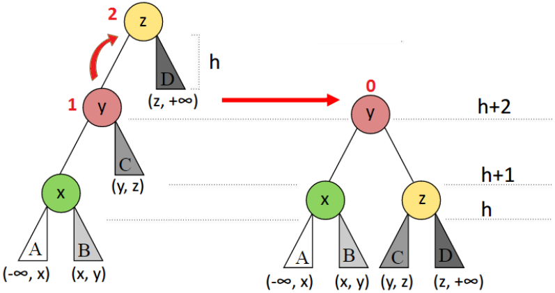
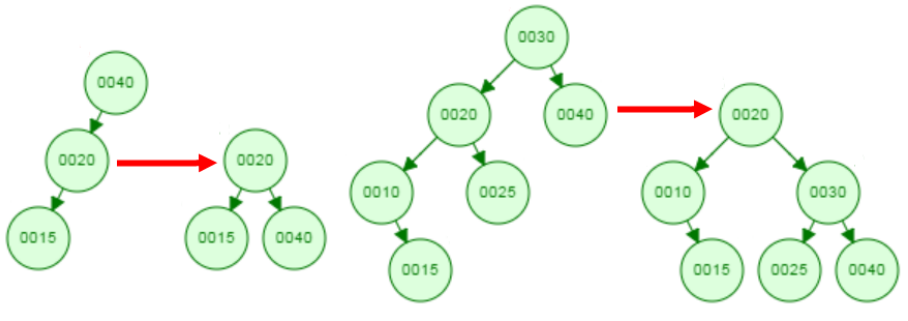
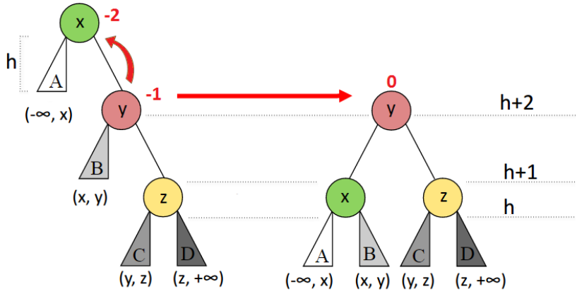
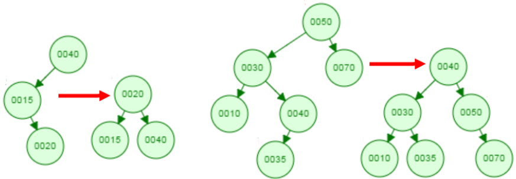
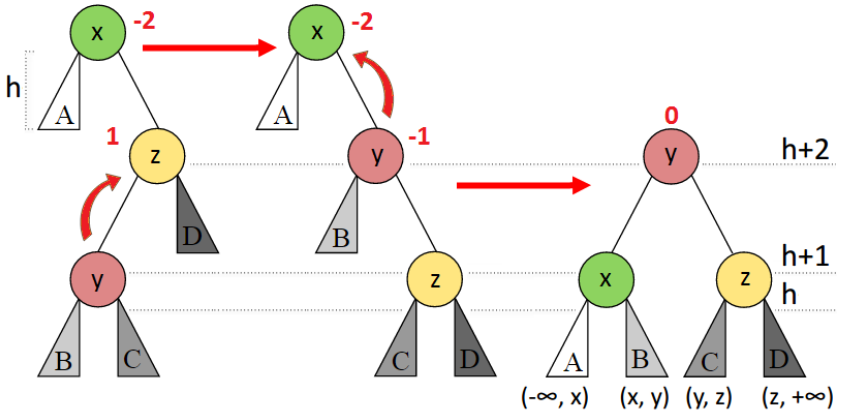
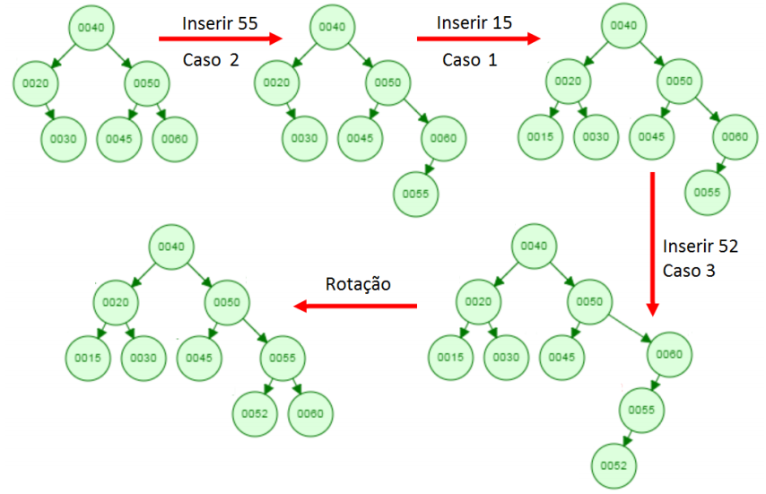
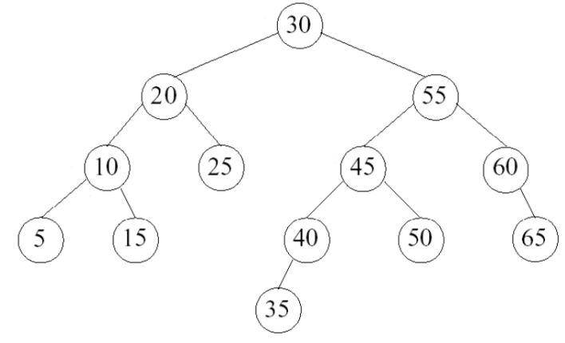
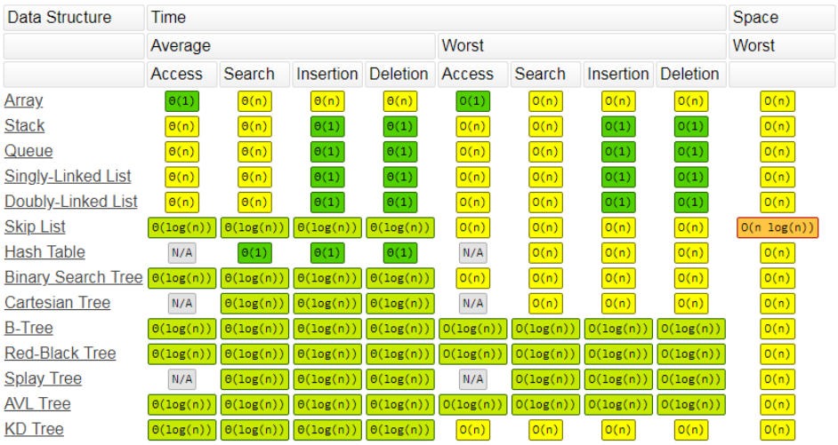

# Árvores AVL
*Retirado dos slides da Prof. Mirtha Lina, CMCC/UFABC.*

## Balanceamento nas Árvores AVL - Rotações

### Árvore AVL e Fator de Balanceamento de um nó $n$

- Como manter as árvores AVL balanceadas após uma inserção ou remoção?
- Como preservar a ordem simétrica das ABS?
- Como manter o custo logarítmico das operações?

**Resposta:** usar **transformações locais** (de baixo custo - $O(1)$) que 
somente sejam efetuadas no caminho da operação.

**Rotações:** Permitem trocar o papel da raiz (nó com FB igual a -2 ou 2)
e um dos filhos, preservando a ordem das chaves

- **Simples:** Esquerda ou Direita;
- **Dupla:** (Direita-) Esquerda ou (Esquerda-) Direita.

### Rotação Simples à Direita - Caso LL

- O desbalanceamento está à esquerda-esquerda;
- Troca o papel da raiz e o filho esquerdo preservando a ordem.

<p align="center">
  
</p>

#### Exemplos

- O desbalanceamento está à esquerda-esquerda: o nó desbalanceado
tem $FB = 2$ e o filho esquerdo $FB = 1$ (note-se que é o mesmo
sinal do pai!);
- Rotaciona a raiz e o filho esquerdo em sentido horário.

<p align="center">
  
</p>

### Rotação Simples à Esquerda - Caso RR

- O desbalanceamento está à direita-direita;
- Troca o papel da raiz e o filho direito preservando a ordem.

<p align="center">
  
</p>

#### Exemplos

- O desbalanceamento está à direita-direita: o nó desbalanceado
tem $FB = -2$ e o filho direito $FB = -1$ (note-se que é o mesmo
sinal do pai!);
- Rotaciona a raiz e o filho direito em sentido anti-horário.

<p align="center">
  
</p>

### Rotação Dupla à Direita - Caso LR

- O desbalanceamento está à esquerda-direita;
- Duas rotações simples: 1ª à esquerda; 2ª à direita.

<p align="center">
  
</p>

#### Exemplos

- O desbalanceamento está à esquerda-direita: o nó desbalanceado
tem $FB = 2$ e o filho direito $FB = -1$ (sinal inverso do pai!);
- Rotaciona duas vezes o neto que está à esquerda-direita: primeiro
à esquerda e depois à direita.

<p align="center">
  
</p>

### Rotação Dupla à Esquerda - Caso RL

- O desbalanceamento está à direita-esquerda;
- Duas rotações simples: 1ª à direita; 2ª à esquerda.

<p align="center">
  
</p>

#### Exemplos

- O desbalanceamento está à direita-esquerda: o nó desbalanceado
tem $FB = -2$ e o filho direito $FB = 1$ (sinal inverso do pai!);
- Rotaciona duas vezes o neto que está à direita-esquerda: primeiro
à direita e depois à esquerda.

<p align="center">
  
</p>

### Resumo Rotações

- São simétricas

<p align="center">
  
</p>

- Nas simples, o nó não balanceado tem FB com o mesmo sinal do filho mais
alto ("simétrico" à rotação). São aplicadas no sentido inverso à maior altura;

- Nas duplas, o nó não balanceado tem FB o sinal inverso do filho mais
alto ("simétrico" à rotação). São compostas por uma rotação simples e a simétrica.

## Inserção nas Árvores AVL

- Inserir o nó da mesma forma que nas ABBs.  No caminho de volta
até a raíz, atualizar a altura de cada nó n, checar se não cumpre a
condição AVL e rotacionar de forma apropriada;
- **Caso 1:** A nova chave foi inserida na sub-árvore de menor altura,
a altura **não** muda e a árvore fica balanceada;
- **Caso 2:** O nó tinha $FB = 0$ antes da inserção, atualizar a altura.
É preciso conferir a condição AVL dos antecessores;
- **Caso 3:** A nova chave foi inserida na sub-árvore de maior altura
(direita ou esquerda resp), efetuar a rotação. Não é preciso conferir
o balanceamento dos antecessores.

**Exemplo:** Inserir as seguintes chaves em uma árvore AVL: 40, 20, 50, 30, 45,
60, **55**, **15**, **52**.

[AVL Tree Visualization](https://www.cs.usfca.edu/~galles/visualization/AVLtree.html)

<p align="center">
  
</p>

No caso 3, a altura da sub-árvore após o balanceamento é a mesma que antes
da inserção.

**Exercício:** Inserir as seguintes chaves em uma árvore AVL:
maio, março, novembro, agosto, abril, janeiro, dezembro, fevereiro,
julho, junho outubro, setembro.

### Exemplo de Implementação - Inserção AVL

```c
void insertAVL(AVLTreeNode ** treeRoot,  int key) {
  if (*treeRoot == NULL) {
  
    // Update the root to point at a new node.
    AVLTreeNode * newNode = malloc(sizeof(AVLTreeNode));
    *treeRoot = newNode;
    
    if (!newNode)
        return;
  
    newNode->key = key;
    newNode->left = newNode->right = NULL;
    newNode->height = 0;
    return;
  }
  
  if (key == (*treeRoot)->key)
    return;
  
  AVLTreeNode * tree = *treeRoot;

  if (key < tree->key) { // Recursively move to the left.
    insertAVL(&tree->left, key);
    
    // Check if balanceFactor must be updated.
    if (balanceFactor(tree) == 2) {
      // Went left from node that is already heavy
      // on the left. Violates AVL condition; rotate.
      if (key < tree->left->key)
        rotateCaseLL(&tree);
        
      // Inserting in the left right.
      else rotateCaseLR(&tree);
    } 
  } else { // Otherwise recursively move right.
    insertAVL(&tree->right, key);
    
    // Check if balanceFactor must be updated.
    if (balanceFactor(tree) == -2) {
      // Went right from node that is already heavy
      // on the right. Violates AVL condition; rotate.
      if (key > tree->right->key)
        rotateCaseRR(&tree);
        
      // Inserting in the right left.
      else caseRLrotateRightLeft(&tree);
    } 
  }
  
  updateHeight(tree);
  *treeRoot = tree;
}
```

## Remoção nas Árvores AVL

Remover o nó da mesma forma que nas ABBs. No caminho de volta
desde o pai da **folha removida** até a raiz, atualizar a 
altura de cada nó $n$, checar se não cumpre a condição AVL e rotacionar.

- O fator de balanceamento pode mudar;
- A árvore pode diminuir sua altura;
- Pode ser necessário rotacionar todos os nós no caminho de volta.

### Exercício

Remover da árvore AVL abaixo as seguintes chaves: 5, 20, 50.

<p align="center">
  
</p>

## Conclusões

- A altura de uma árvore AVL é aproximadamente igual $1.44 \cdot \log_2(n)$ onde
$n$ é o número de nós da árvore;
- O balanceamento usa transformações simples, locais, simétricas, de custo
constante;
- As operações de busca e inserção tem custo $O(\log_2(n))$ no caso médio e
também no caso pior.

| Técnica          | Ordem | Busca     | Inserção  | Remoção   |
| ---------------- | :---: | :-------: | :-------: | :-------: |
| Busca sequencial | Não   | $n$       | $n$       | $n$       |
| Busca Binária    | Sim   | $\log(n)$ | $n$       | $n$       |
| ABB              | Sim   | $h$       | $h$       | $h$       |
| AVL              | Sim   | $\log(n)$ | $\log(n)$ | $\log(n)$ |

- Inserção simples, após inserir **basta uma rotação para tornar a árvore AVL**;
- A remoção **pode precisar** $\log(n)$ **rotações**;
- Precisa armazenar a altura ou o fator de balanceamento (mais dois bits
por nó).

**É possível melhorar isto?** Sim, árvores preto-vermelho.

## Complexidade das Estruturas de Dados

<p align="center">
  
</p>

http://bigocheatsheet.com/

## Referências Bibliográficas

- Donald Knuth. **The Art of Computer Programming, Volume 3: Sorting
and Searching, 3rd Ed**. Addison-Wesley, 1997, pages 458-475,
section 6.2.3: Balanced Trees.
- Jayme L. Szwarcfiter; Lilian Markezon. **Estruturas de Dados e seus
Algoritmos, 3ª edição**. 2010.
- Don Spickler, [Tutorial AVL TREES].
- Wikipédia: [AVL tree], [Red-black tree], [B tree].
- AVL Tree Visualization.

  https://www.cs.usfca.edu/~galles/visualization/AVLtree.html

[Tutorial AVL TREES]: http://facultyfp.salisbury.edu/despickler/personal/Resources/AdvancedDataStructures/Handouts/AVL_TREES.pdf
[AVL tree]: https://en.wikipedia.org/wiki/AVL_tree
[Red-black tree]: https://en.wikipedia.org/wiki/Red-black_tree
[B tree]: https://en.wikipedia.org/wiki/B-tree