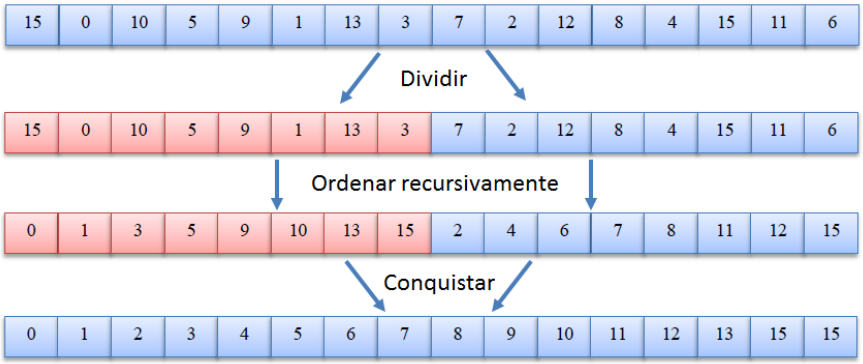
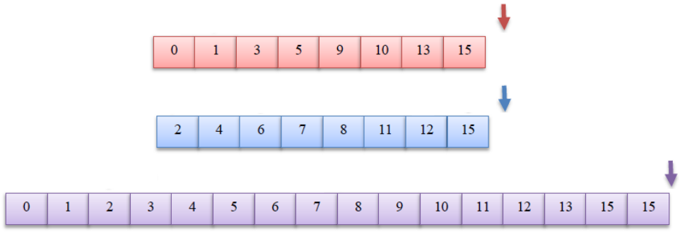
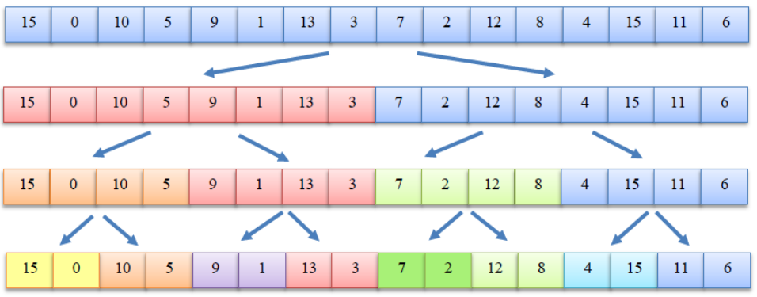
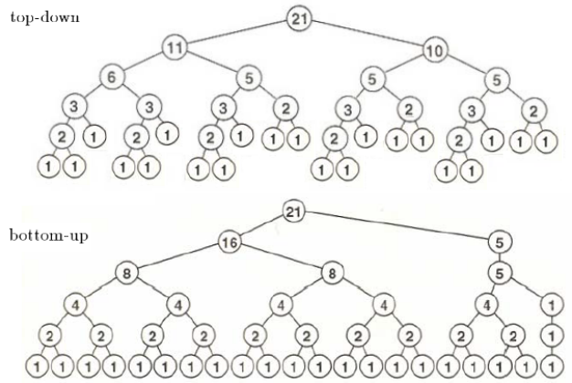
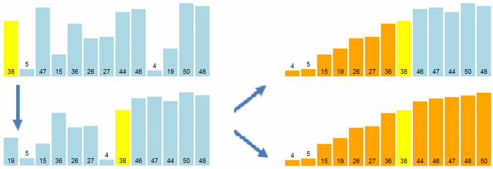
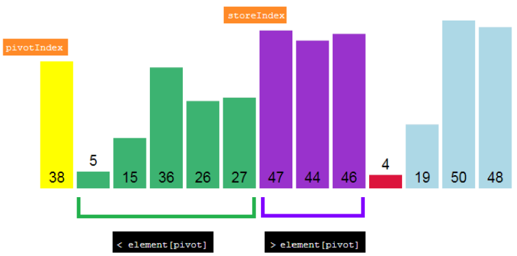

# Algoritmos de Ordenação Ótimos

## Introdução

### Aula anterior: Introdução aos Algoritmos de ordenação

**Algoritmos elementares de ordenação**, baseados em comparações, de custo
 no caso pior.
- Ordenação por troca (*bubble sort*);
- Ordenação por seleção (*selection sort*);
- Ordenação por inserção (*insertion sort*).

**Algoritmos de ordenação bons**
- Shellsort

**Limite assintótico da ordenação baseada em comparações** é 
, i.e. qualquer algoritmo de ordenação baseado em 
comparações usa no mínimo  comparações no caso pior.

**Hoje:** Algoritmos de ordenação ótimos.

## Mergesort

### Mergesort - Ordenação por intercalação

- Inventado por John von Neumann em 1945;
- Algoritmo simples, de propósito geral, ótimo, estável;
- Exemplo clássico de algoritmo recursivo de divisão e conquista;
- A conquista é feita usando intercalação.

<p align="center">
  
</p>

<p align="center">
  
</p>

### Intercalação - Merge

Combinação de dois ou mais arranjos (arquivos, listas) de entrada
ordenados em um único arranjo ordenado.

<p align="center">
  
</p>

- Comparar os primeiros de cada arranjo de entrada e copiar o menor
para o arranjo de saída.

### Algoritmo de Intercalação

- Simples usando memória auxiliar;
- Uma das duas listas vai acabar primeiro; passar diretamente os restantes.
Ao intercalar elementos iguais dar prioridade ao primeiro arranjo; isto
garante a estabilidade da ordenação;
- A memória auxiliar pode ser de tamanho  
(**Exercício independente**);
- Existem variantes que usam memória auxiliar  (*in-place*); porém
ou são mais complexas e/ou menos ineficientes.


### Algoritmo de Ordenação por Intercalação (Mergesort)

- Dividir o vetor em duas partes de tamanhos similares e ordenar
recursivamente;
- Intercalar os sub-vetores ordenados.

```c
long int MergeSort (int * v, int lo, int hi) {
  long int comp = 0;

  if (lo < hi) {
    int mid = lo + (hi - lo) / 2;
    comp += MergeSort(v, lo, mid);
    comp += MergeSort(v, mid + 1, hi);
    comp += merge(v, lo, mid, hi);
  }

  return comp;
}
```

### Análise do Mergesort

O arranjo é sempre dividido na metade. No caso pior, o tamanho do
arranjo inicial é potência de 2. Para a intercalação temos,
- **Caso pior:** Todos os elementos são comparados no mínimo uma vez
(os dois maiores não estão no mesmo sub-vetor);
- **Caso melhor:** Quando metade dos elementos são comparados
(o maior de um vetor é menor que o primeiro do outro).

<p align="center"></p>

Relembrando o Teorema Mestre: 

1. 
2. 
3.  e existe  tal que para todo
 suficientemente grande 

Neste caso , , , .
Logo, pelo caso 2, .

A recorrência geral tem a forma . A mesma solução é obtida usando
indução.

### Aprimorando o algoritmo

O mergesort não é sensível aos dados de entrada.

http://www.sorting-algorithms.com/merge-sort

- Antes de intercalar testar se o vetor já está ordenado. Isso evita a 
intercalação mas não as chamadas recursivas (**como?**);
- Usar inserção para arranhos pequenos (ex. `tamanho < 25`);
- É possível eliminar a cópia ao vetor auxiliar durante a intercalação
(reduz o tempo mas não o espaço).

### Mergesort iterativo

#### Árvore de Partições

<p align="center">
  
</p>

A recursividade é usada para definir as partições do vetor que
precisam ser intercaladas e a ordem das intercalações.

O mergesort recursivo faz um percurso em post-ordem da árvore.
No entanto, qualquer outro percurso que visite primeiro os filhos
e depois o nó pode ser usado.

**É possível fazer um percurso por níveis, de baixo para cima!**

#### Bottom-Up Mergesort

<p align="center">
  
</p>

### Top-Down vs Bottom-Up Mergesort

- Se  não é uma potência de 2, então o conjunto de intercalações das
duas variantes é diferente;

<p align="center">
  <br>
  Robert Sedgewick, Algorithms, 4th Edition, Addison-Wesley, 2011
</p>

- O número de comparações é menor na variante recursiva;

  |           | best case                      | average case        | worst case |
  | --------- | ------------------------------ | ------------------- | ---------- |
  | top-down  |  |  |  |
  | bottom-up |  |  |  |

  Bottom-up mergesort - A detailed analysis. W. Panny, H. Prodinger, Algorithmica,
  14 (4): 340-354, 1995.

- A versão recursiva é mais rápida;

  |        | 100000 | 200000 | 400000 | 800000 |
  | --------- | :----: | :----: | :----: | :----: |
  | top-down  | 53     | 111    | 237    | 524    |
  | bottom-up | 59     | 127    | 267    | 568    |

  Robert Sedgewick, Algorithms, 4th Edition, Addison-Wesley, 2011.

- Existe uma variante não recursiva que aproveita as sequencias ordenadas
do arranjo de entrada (*natural mergesort*).

## Quicksort

- Inventado por Tony Hoare em 1959 sendo estudante e publicado em 1961;
- Refinado e analisado por Robert Sedgewick em 1976;
- Exemplo clássico de algoritmo recursivo de divisão e conquista;
- A conquista é feita de forma inteligente particionando a sequência
antes de dividir sem precisar de memória auxiliar.

<p align="center">
  
</p>

### Particionamento

- Escolher um elemento pivô de forma tal que no final ele seja colocado
na posição certa;
- Separar os elementos menores e maiores ou iguais ao pivô usando
trocas;

<p align="center">
  
</p>

- A parte mais importante do Quicksort, tem custo linear;
- A escolha do elemento pivô influencia como é feito o particionamento
e o desempenho do Quicksort;
- Pode ser usado um elemento aleatório, ou a mediana de uma amostra
do vetor (ex. primeiro, último, meio);
- Pode mudar a ordem relatia de registros com a mesma chave.

### O algoritmo

```c
int QuickSort (int * v, int lo, int hi) {
  int comp = 0;

  if (lo < hi) {
    int mid = partition(v, lo, hi, &comp);
    comp += QuickSort(v, lo, mid - 1);
    comp += QuickSort(v, mid + 1, hi);
  }

  return comp;
}
```

Ver exemplo completo [aqui](optimal-sorting-algorithms.c).

### Análise do Quicksort

- **Caso melhor:** o vetor é sempre particionado na metade.

<p align="center"></p>

- **Caso pior:** a sequência já está ordenada (crescente ou decrescente).

<p align="center"></p>

**Como evitar o caso pior?** Inicialmente embaralhar o vetor.

- Para sub-vetores pequenos, usar ordenação por inserção. Nesses casos
também é possível ignorar a chamada e ordenar por inserção somente uma
vez no final;
- Primeiro ordenar a partição menor para garantir que o algoritmo seja
in-place, i.e.  chamadas na pilha.

## Conclusões

### Mergesort

- Implementação elegante tanto de forma recursiva como iterativa;
tanto em vetores quanto em listas ligadas; tanto em memória itnerna
como externa;
- Único ótimo () e estável porém não adaptativo;
- Usa memória auxiliar . As variantes in-place usam mais comparações
e movimentações ou não são estáveis. A versão para listas ligadas usa
memória auxiliar .

### Quicksort

- Algoritmo ótimo in-place muito eficiente (se implementado de
maneira correta);
- Não é estável nem adaptativo; porém existe uma versão adaptativa
(3-way Quicksort);
- Há variantes para ordenação por distribuição, parcial e externa.

## Referências Bibliográficas

- Algorithms, Robert Sedgewick and Kevin Wayne, 4th Edition, 2011.
  
  Slides: http://algs4.cs.princeton.edu/lectures/
- Introduction to Algorithms, 3rd Edition. Thomas H. Cormen, Charles
E. Leiserson, Ronald L. Rivest and Clifford Stein, 2009.
- The Art of Computer Programming 3rd Edition, Donald Knuth, Section
5.2.4: Sorting by Merging, 1997.
- Projeto de Algoritmos, 2ª Edição, Nivio Ziviani, 2007.
- Estruturas de Dados e seus Algoritmos, 3ª Edição, Jayme L. Szwarcfiter and
Lilian Markezon, 2010.
- Comparison Sorting Algorithms

  https://www.cs.usfca.edu/~galles/visualization/ComparisonSort.html
- Sorting Algorithms Animation

  http://www.sorting-algorithms.com/