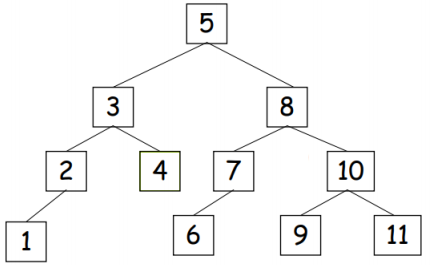

# Lista de Exercícios 7: Árvores AVL

1. Escreva uma função que dada uma ABB `A` de inteiros e uma chave `k`, transforme 
`A` usando rotações do forma tal que `k` seja raiz. Note que se `k` não estiver em
`A`, ela deve ser primeiro inserida e depois colocada na raiz.

2. Escreva um programa que dada uma ABB de caracteres determine se é ou não AVL.

3. Desenhe passo a passo as árvores que resultam de inserir numa árvore AVL vazia
as seguintes chaves: 100, 80, 60, 40, 20, 70, 30, 50, 35, 45, 55, 75, 65, 73, 77. 
Indique em cada passo a rotação efetuada.

4. Desenhe cada uma das árvores resultantes de remover os seguintes nós 
(nessa ordem) da árvore AVL abaixo: 4, 6, 7, 3, 2, 1, 5. Em cada passo, 
mostre as rotações usadas.

  

5. Escreva uma função para remover um elemento de uma árvore AVL.

6. **Contagem de Palavras:** Escreva um programa que dado um arquivo de entrada com
um texto de tamanho arbitrário gere um outro arquivo de saída tal que cada linha do
arquivo de saída tenha uma palavra do arquivo de entrada e o número de ocorrências
dela no texto. O arquivo de saída deve estar ordenado por palavras. Assuma que o
texto de entrada somente contem palavras em minúsculas separadas por espaço.

   Por exemplo: Se o arquivo de entrada contem o seguinte texto:

       the beatles were one of the most influential music groups of the rock era

   então o arquivo de saída deve conter o seguinte:

       beatles 1
       era 1
       groups 1
       influential 1
       most 1
       music 1
       of 2
       one 1
       rock 1
       the 3
       were 1

7. Explique qual a complexidade do seu programa para o exercício anterior no 
caso pior.
