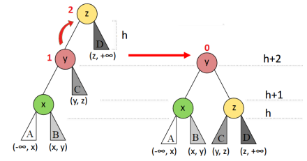
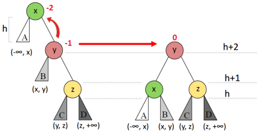
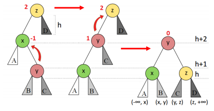
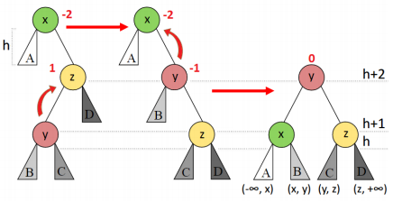

# RAs e Notas (AVL)
*Exercício do Prof. Paulo H. Pisani, CMCC/UFABC.*

O professor ABC guarda os RAs (número de registro do aluno) e nota de cada aluno em
um sistema. Esse sistema usa uma árvore binária de busca (AVL). O sistema possui
funções para incluir e remover dados. Para avaliar o desempenho do sistema, o
professor ABCresolveu adicionar alguns indicadores: altura da árvore e quantidade
de comparações realizadas na busca.

## Exercício

Escreva um programa em linguagem C que receba uma sequência de operações (inserção,
remoção, busca e obter altura). Quando for feita uma **operação de busca**, o
programa deve imprimir a quantidade de comparações realizadas na **árvore binária
de busca**. Nas operações de inserção e remoção o programa deve mostrar detalhes
do balanceamento, conforme especificado na seção **Rotações**. 

Salve o código no arquivo: `alvnotas.c`. O programa deverá utilizar
uma **árvore AVL**.

**Atenção:** libere a árvore da memória ao final do programa.

## Entrada e saída

O sistema receberá diversas entradas e, dependendo da operação, pode haver
parâmetros adicionais:

<table>
  <thead>
    <th>Operação</th>
    <th>Exemplo</th>
    <th>Descrição</th>
  </thead>
  <tbody>
    <tr>
      <td><code>I [RA] [Nota]</code></td>
      <td><code>I 90 8</code></td>
      <td>
        <b>Insere</b> um item na árvore, com o RA e a nota informados. RA e nota
         
        são números inteiros (<code>int</code>). <i>Caso o RA informado já exista na
         
        árvore, apenas a nota é atualizada (e não é inserido um novo nó).
         
        Portanto, não haverá nós com RAs repetidos na árvore.
         
        O programa deve imprimir detalhes sobre o balanceamento, conforme
         
        especificado na seção <b>Rotações</b></i>.
      </td>
    </tr>
    <tr>
      <td><code>R [RA]</code></td>
      <td><code>R 90</code></td>
      <td>
        <b>Remove</b> o nó com o RA informado. Para a remoção, use a remoção
         
        por cópia de T. Hibbard e D. Knuth. Considere a versão que usa o
         
        <b>sucessor</b> quando um elemento que possui duas subárvores não
         
        nulas é removido.
         
        <i>O programa deve imprimir detalhes sobre o balanceamento, conforme
         
        especificado na seção <b>Rotações</b></i>.
      </td>
    </tr>
    <tr>
      <td><code>B [RA]</code></td>
      <td><code>B 90</code></td>
      <td>
        <b>Busca</b> o nó com o RA informado. Após realizar a busca, mostre a
         
        <b>quantidade de comparações realizadas</b> até o fim da busca e a <b>nota</b>
         
        <b>do aluno</b> no seguinte formato: <code>C=[NumComparações] Nota=[Nota]</code>.
         
        Por exemplo, <code>C=2 Nota=9</code>. Quando o RA não for encontrado,
         
        assuma nota = -1. Por exemplo, <code>C=2 Nota=-1</code>.
      </td>
    </tr>
    <tr>
      <td><code>A</code></td>
      <td><code>A</code></td>
      <td>
        Mostra a <b>altura</b> da árvore no formato <code>A = [Altura]</code>.
         
        Por exemplo, <code>A=3</code>.
      </td>
    </tr>
    <tr>
      <td><code>P</code></td>
      <td><code>P</code></td>
      <td>
        Imprime a árvore em pós-ordem, libera a árvore da memória e finaliza
         
        o programa. Imprimir <code>[]</code> se a árvore já estiver vazia.
      </td>
    </tr>
  </tbody>
</table>

## Rotações

Há quatro rotações possíveis em uma AVL. As figuras a seguir são dos slides
da aula sobre Árvores AVL.

### Rotação simples à direita (SD)

  

### Rotação simples à esquerda (SE)

  

### Rotação dupla à direita (DD)

  

### Rotação dupla à esquerda (DE)

  

Após uma inserção ou remoção, deve ser impresso `[Ja esta balanceado]` se não
foi necessário aplicar qualquer rotação para balancear a árvore. Caso seja
aplicada alguma rotação, deve ser impresso o nó desbalanceado, a rotação
aplicada e os nós envolvidos. Utilize o formato do exemplo a seguir:

    [No desbalanceado: 16]
    [Rotacao: SE]
    [x=16 y=20 z=22]

#### Observações

- Não há acentos nas palavras impressas;
- Os valores `x`, `y` e `z` referem-se aos nós especificados nas figuras das
rotações apresentadas;
- Na remoção, pode haver mais de uma rotação.

## Exemplos

### Exemplo 1 (sem remoção)

Para a entrada

    I 8 10
    I 16 9
    I 20 5
    A
    I 10 5
    I 15 4
    B 15
    P

a saída deve ser:

    [Ja esta balanceado]
    [Ja esta balanceado]
    [No desbalanceado: 8]
    [Rotacao: SE]
    [x=8 y=16 z=20]
    A=1
    [Ja esta balanceado]
    [No desbalanceado: 8]
    [Rotacao: SE]
    [x=8 y=10 z=15]
    C=3 Nota=4
    [8 15 10 20 16 ]

### Exemplo 2 (sem remoção)

Para a entrada

    I 20 10
    I 10 7
    I 5 9
    I 8 4
    I 6 8
    I 15 9
    I 18 9
    A
    B 20
    P

a saída deve ser:

    [Ja esta balanceado]
    [Ja esta balanceado]
    [No desbalanceado: 20]
    [Rotacao: SD]
    [x=5 y=10 z=20]
    [Ja esta balanceado]
    [No desbalanceado: 5]
    [Rotacao: DE]
    [x=5 y=6 z=8]
    [Ja esta balanceado]
    [No desbalanceado: 20]
    [Rotacao: DD]
    [x=15 y=18 z=20]
    A=2
    C=3 Nota=10
    [5 8 6 15 20 18 10 ]

### Exemplo 3 (com remoção)

Para a entrada

    I 8 10
    I 16 9
    I 20 5
    A
    I 10 5
    I 15 4
    B 15
    R 8
    R 16
    A
    B 20
    P

a saída deve ser:

    [Ja esta balanceado]
    [Ja esta balanceado]
    [No desbalanceado: 8]
    [Rotacao: SE]
    [x=8 y=16 z=20]
    A=1
    [Ja esta balanceado]
    [No desbalanceado: 8]
    [Rotacao: SE]
    [x=8 y=10 z=15]
    C=3 Nota=4
    [Ja esta balanceado]
    [No desbalanceado: 20]
    [Rotacao: DD]
    [x=10 y=15 z=20]
    A=1
    C=2 Nota=5
    [10 20 15 ]

### Exemplo 4 (com remoção que requer duas rotações)

Para a entrada

    I 50 6
    I 25 6
    I 78 8
    I 15 0
    I 40 9
    I 60 5
    I 80 5
    I 35 10
    I 55 10
    I 65 3
    I 90 9
    I 62 7
    A
    R 15
    R 55
    A
    B 40
    B 60
    P

a saída deve ser:

    [Ja esta balanceado]
    [Ja esta balanceado]
    [Ja esta balanceado]
    [Ja esta balanceado]
    [Ja esta balanceado]
    [Ja esta balanceado]
    [Ja esta balanceado]
    [Ja esta balanceado]
    [Ja esta balanceado]
    [Ja esta balanceado]
    [Ja esta balanceado]
    [Ja esta balanceado]
    A=4
    [No desbalanceado: 25]
    [Rotacao: DE]
    [x=25 y=35 z=40]
    [No desbalanceado: 50]
    [Rotacao: DE]
    [x=50 y=60 z=78]
    [No desbalanceado: 50]
    [Rotacao: SD]
    [x=25 y=35 z=50]
    A=3
    C=4 Nota=9
    C=1 Nota=5
    [25 40 50 35 62 65 90 80 78 60 ]